<!-- Generated from profile.config.json with Nabhan's profile builder. -->
<!-- PROFILE-HERO:START -->

  <picture>
    <source media="(max-width: 760px) and (prefers-color-scheme: dark)" srcset="./assets/hero/terminal-profile-13f30292-mobile-dark.svg">
    <source media="(max-width: 760px)" srcset="./assets/hero/terminal-profile-13f30292-mobile-light.svg">
    <source media="(prefers-color-scheme: dark)" srcset="./assets/hero/terminal-profile-13f30292-dark.svg">
    <source media="(prefers-color-scheme: light)" srcset="./assets/hero/terminal-profile-13f30292-light.svg">
    
  </picture>

<!-- PROFILE-HERO:END -->

## About Me

I build practical systems at the intersection of software engineering, artificial intelligence, and cybersecurity, turning complex problems into reliable solutions.

I approach technology with a builder’s mindset: understand how things work, test them in practice, break what doesn’t hold up, and share what I learn.

## My-TechStack

  <table>
    <tr>
      <td align="center" width="96" style="padding: 10px;">
        
         HTML
      </td>
      <td align="center" width="96" style="padding: 10px;">
        
         CSS
      </td>
      <td align="center" width="96" style="padding: 10px;">
        
         Bootstrap
      </td>
      <td align="center" width="96" style="padding: 10px;">
        
         JavaScript
      </td>
      <td align="center" width="96" style="padding: 10px;">
        
         Figma
      </td>
    </tr>
    <tr>
      <td align="center" width="96" style="padding: 10px;">
        
         Laravel
      </td>
      <td align="center" width="96" style="padding: 10px;">
        
         AWS
      </td>
      <td align="center" width="96" style="padding: 10px;">
        
         Docker
      </td>
      <td align="center" width="96" style="padding: 10px;">
        
         TypeScript
      </td>
      <td align="center" width="96" style="padding: 10px;">
        
         Python
      </td>
    </tr>
    <tr>
      <td align="center" width="96" style="padding: 10px;">
        
         MySQL
      </td>
      <td align="center" width="96" style="padding: 10px;">
        
         Postman
      </td>
      <td align="center" width="96" style="padding: 10px;">
        
         GitHub
      </td>
      <td align="center" width="96" style="padding: 10px;">
        
         Linux
      </td>
      <td align="center" width="96" style="padding: 10px;">
        
         Arch Linux
      </td>
    </tr>
  </table>

## Current Focus

| Area | What I am exploring |
| --- | --- |
| **Cybersecurity** | Offensive security, vulnerability research, system analysis, and practical security testing. |
| **Software Engineering** | Building reliable, maintainable software that turns complex ideas into practical and testable systems. |
| **Artificial Intelligence** | Building and evaluating intelligent systems that can reason, use tools, adapt to context, and operate reliably in real-world environments. |
| **Security Research** | Exploring how systems break, identifying vulnerabilities, and developing practical techniques to understand, test, and improve their security. |

## Research Direction

I am interested in understanding how intelligent systems interact with real-world environments: how they observe state, use tools, evaluate outcomes, and take bounded actions while maintaining clear evidence, security, and meaningful human oversight.

## GitHub Stats

## GitHub Contribution Game

<picture>
  <source
    media="(prefers-color-scheme: dark)"
    srcset="https://raw.githubusercontent.com/cxnbhnq-a/cxnbhnq-a/output/github-snake-dark.svg">
  <source
    media="(prefers-color-scheme: light)"
    srcset="https://raw.githubusercontent.com/cxnbhnq-a/cxnbhnq-a/output/github-snake.svg">
  
</picture>

## Connect With Me

---

Exploring Security, Building Technology, and Creating Solutions

