<!-- Generated from profile.config.json with Nabhan's profile builder. -->

  <picture>
    <source media="(max-width: 760px) and (prefers-color-scheme: dark)" srcset="./assets/hero/terminal-profile-5ec5d596-mobile-dark.svg">
    <source media="(max-width: 760px)" srcset="./assets/hero/terminal-profile-5ec5d596-mobile-light.svg">
    <source media="(prefers-color-scheme: dark)" srcset="./assets/hero/terminal-profile-5ec5d596-dark.svg">
    <source media="(prefers-color-scheme: light)" srcset="./assets/hero/terminal-profile-5ec5d596-light.svg">
    
  </picture>

<strong>Cyber Security | IT Enthusiast</strong>

## About Me

I build practical systems at the intersection of software engineering, artificial intelligence, and cybersecurity, turning complex problems into reliable solutions.

I approach technology with a builder’s mindset: understand how things work, test them in practice, break what doesn’t hold up, and share what I learn.

- Cyber Security Enthusiast
- Full-Stack Developer
- System Administrator
- UI/UX Designer
- Traveler Enthusiast
- Cilacap, Indonesia

## Skills

<table>
<tr><td align="center" width="96"> Python</td><td align="center" width="96"> JavaScript</td><td align="center" width="96"> TypeScript</td><td align="center" width="96"> React</td><td align="center" width="96"> Next.js</td></tr>
<tr><td align="center" width="96"> Node.js</td><td align="center" width="96"> Linux</td><td align="center" width="96"> Burp Suite</td><td align="center" width="96"> VS Code</td><td align="center" width="96"> HTML</td></tr>
<tr><td align="center" width="96"> CSS</td><td align="center" width="96"> Bootstrap</td><td align="center" width="96"> Figma</td><td align="center" width="96"> Laravel</td><td align="center" width="96"> Docker</td></tr>
<tr><td align="center" width="96"> Arch Linux</td><td align="center" width="96"> MySQL</td><td align="center" width="96"> Postman</td><td align="center" width="96"> GitHub</td><td align="center" width="96"> Kotlin</td></tr>
<tr><td align="center" width="96"> Kali Linux</td></tr>
</table>

## Current Focus

| Area | What I am exploring |
| --- | --- |
| **Cybersecurity** | Offensive security, vulnerability research, system analysis, and practical security testing. |
| **Software Engineering** | Building reliable, maintainable software that turns complex ideas into practical and testable systems. |
| **Artificial Intelligence** | Building and evaluating intelligent systems that can reason, use tools, adapt to context, and operate reliably in real-world environments. |
| **Security Research** | Exploring how systems break, identifying vulnerabilities, and developing practical techniques to understand, test, and improve their security. |

## Featured Work

| Project | Focus | Details |
| --- | --- | --- |
| [**Web Security**](https://github.com/cxnbhnq-a) | Web App Security & Offensive Security | Research into web security, covering vulnerability discovery, auth & access control testing, API security, WordPress exploitation, and practical exploit validation in authorized environments. |
| [**Web App Dev**](https://github.com/cxnbhnq-a) | Full-Stack Web Development | Building practical web applications with modern technologies, focusing on clean implementation, useful functionality, responsive interfaces, and reliable user experiences. |

## Research Direction

I am interested in understanding how intelligent systems interact with real-world environments: how they observe state, use tools, evaluate outcomes, and take bounded actions while maintaining clear evidence, security, and meaningful human oversight.

## Tech Stack

`Python` · `JavaScript` · `TypeScript` · `React` · `Next.js` · `Node.js` · `Linux` · `Burp Suite` · `VS Code` · `HTML` · `CSS` · `Bootstrap` · `Figma` · `Laravel` · `Docker` · `Arch Linux` · `MySQL` · `Postman` · `GitHub` · `Kotlin` · `Kali Linux`

## GitHub Stats

## Connect With Me

---

Exploring Security, Building Technology, and Creating Solutions

