<h1 align="center">Nabhan Qori Albana</h1>

<h3 align="center">
Cyber Security | Full-Stack Developer | Software Engineer
</h3>

---

<!-- Generated by GitHub Profile Agent Console. Edit profile.config.json, then run npm run generate. -->

  <picture>
    <source media="(max-width: 760px) and (prefers-color-scheme: dark)" srcset="./assets/hero/agent-console-c1d9c834-mobile-dark.svg">
    <source media="(max-width: 760px)" srcset="./assets/hero/agent-console-c1d9c834-mobile-light.svg">
    <source media="(prefers-color-scheme: dark)" srcset="./assets/hero/agent-console-c1d9c834-dark.svg">
    <source media="(prefers-color-scheme: light)" srcset="./assets/hero/agent-console-c1d9c834-light.svg">
    
  </picture>

  

---

# 🧑‍💻 About Me

* 🔐 Cyber Security Enthusiast
* 💻 Full-Stack Developer
* 🖥  System Administrator
* 🎨 UI/UX Designer
* 🌍 Traveler Enthusiast
* 📍 Tegal, Jawa Tengah, Indonesia

---

# 🧠 Skills

  <table>
    <tr>
      <td align="center" width="96" style="padding: 10px;">
        
         Vscode
      </td>
      <td align="center" width="96" style="padding: 10px;">
        
         HTML
      </td>
      <td align="center" width="96" style="padding: 10px;">
        
         CSS
      </td>
      <td align="center" width="96" style="padding: 10px;">
        
         JavaScript
      </td>
      <td align="center" width="96" style="padding: 10px;">
        
         Bootstrap
      </td>
    </tr>
    <tr>
      <td align="center" width="96" style="padding: 10px;">
        
         Figma
      </td>
      <td align="center" width="96" style="padding: 10px;">
        
         Laravel
      </td>
      <td align="center" width="96" style="padding: 10px;">
        
         Docker
      </td>
      <td align="center" width="96" style="padding: 10px;">
        
         Arch
      </td>
      <td align="center" width="96" style="padding: 10px;">
        
         Python
      </td>
    </tr>
    <tr>
      <td align="center" width="96" style="padding: 10px;">
        
         MySQL
      </td>
      <td align="center" width="96" style="padding: 10px;">
        
         Postman
      </td>
      <td align="center" width="96" style="padding: 10px;">
        
         GitHub
      </td>
      <td align="center" width="96" style="padding: 10px;">
        
         Kotlin
      </td>
      <td align="center" width="96" style="padding: 10px;">
        
         Kali Linux
      </td>
    </tr>
  </table>

---

# 👾 GitHub Contribution Game

---

# ⚡ GitHub Stats

  

---

# 🔗 Connect With Me

<!-- AUTO:ACTIVITY:START -->
<!-- AUTO:ACTIVITY:END -->

---

   "Exploring Security, Building Technology, and Creating Solutions"

